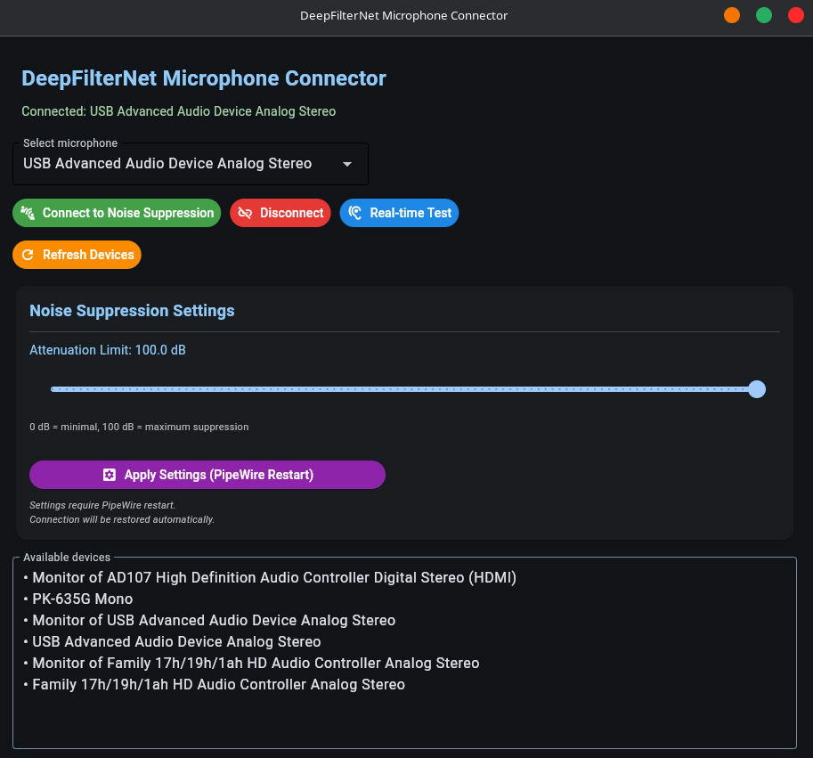

A modern GUI application for managing DeepFilterNet noise suppression on Linux with PipeWire.



## Features

- Easy microphone selection and connection
- Real-time noise suppression
- Adjustable attenuation settings (0-100 dB)
- Live monitoring support
- Auto-reconnection after settings change
- Dark theme UI with Flet

## Prerequisites

- Linux with PipeWire/PulseAudio
- DeepFilterNet LADSPA plugin installed
- Python 3.8+

## Installation

### 1. Install DeepFilterNet

```bash
# Install system dependencies
sudo zypper install rust cargo git pipewire pipewire-tools pipewire-pulseaudio alsa-devel

# Clone and build DeepFilterNet
cd ~
git clone https://github.com/Rikorose/DeepFilterNet.git
cd DeepFilterNet/ladspa
cargo build --release

# Install LADSPA plugin
mkdir -p ~/.ladspa
cp ../target/release/libdeep_filter_ladspa.so ~/.ladspa/
```

### 2. Create PipeWire configuration

```bash
mkdir -p ~/.config/pipewire/pipewire.conf.d/
```

Create `~/.config/pipewire/pipewire.conf.d/99-deepfilter.conf`:

```
context.modules = [
  {   name = libpipewire-module-filter-chain
      args = {
          node.description = "DeepFilter Noise Cancelling"
          media.name       = "DeepFilter Noise Cancelling"
          filter.graph = {
              nodes = [
                  {
                      type   = ladspa
                      name   = deep_filter
                      plugin = "~/.ladspa/libdeep_filter_ladspa.so"
                      label  = deep_filter_mono
                      control = {
                          "Attenuation Limit (dB)" = 100
                      }
                  }
              ]
          }
          audio.rate = 48000
          audio.channels = 1
          audio.position = [ MONO ]
          capture.props = {
              node.name      = "effect_input.deep_filter"
              media.class    = Audio/Sink
              audio.rate     = 48000
              audio.channels = 1
              stream.capture.sink = true
              node.passive   = true
          }
          playback.props = {
              node.name      = "effect_output.deep_filter"
              media.class    = Audio/Source
              audio.rate     = 48000
              audio.channels = 1
          }
      }
  }
]
```

Restart PipeWire:

```bash
systemctl --user restart pipewire pipewire-pulse wireplumber
```

### 3. Install Python application

```bash
# Clone this repository
git clone <your-repo-url>
cd deepfilter_ui

# Install dependencies
pip install -r requirements.txt

# Run application
python main.py
```

## Usage

1. **Launch the application**: `python main.py`
2. **Select your microphone** from the dropdown
3. **Click "Connect to Noise Suppression"**
4. **Adjust attenuation** (0-100 dB) and click "Apply Settings"
5. **Use in Discord/Zoom**: Select "DeepFilter Noise Cancelling" as input device

### Real-time Test

Click "Real-time Test" to hear yourself with noise suppression applied (adds latency, for testing only).

### Attenuation Levels

- **0-30 dB**: Light noise suppression (natural voice)
- **30-60 dB**: Moderate suppression (balanced)
- **60-80 dB**: Strong suppression (noisy environments)
- **80-100 dB**: Maximum suppression (very aggressive)

## Project Structure

```
deepfilter_ui/
├── main.py                 # Entry point
├── models/                 # Data models
│   ├── audio_device.py
│   └── settings.py
├── system/                 # System commands
│   ├── command_executor.py
│   └── pipewire_controller.py
├── core/                   # Business logic
│   ├── device_manager.py
│   ├── config_manager.py
│   └── connector.py
└── ui/                     # User interface
    └── main_window.py
```

## Troubleshooting

### No audio devices showing

```bash
# Check PipeWire status
systemctl --user status pipewire

# List sources
pactl list sources short
```

### Plugin not loading

```bash
# Verify plugin exists
ls -la ~/.ladspa/libdeep_filter_ladspa.so

# Check PipeWire logs
journalctl --user -u pipewire -n 50
```

### Connection fails

```bash
# Restart PipeWire
systemctl --user restart pipewire pipewire-pulse wireplumber
sleep 3

# Try reconnecting
```

## Auto-start on Boot

Create systemd service:

```bash
mkdir -p ~/.config/systemd/user/
nano ~/.config/systemd/user/deepfilter-loopback.service
```

Add:

```ini
[Unit]
Description=DeepFilter Loopback
After=pipewire.service pipewire-pulse.service

[Service]
Type=oneshot
RemainAfterExit=yes
ExecStart=/usr/bin/pactl load-module module-loopback source=YOUR_MIC_NAME sink=effect_input.deep_filter latency_msec=20
ExecStart=/usr/bin/pactl set-default-source effect_output.deep_filter
ExecStop=/usr/bin/pactl unload-module module-loopback

[Install]
WantedBy=pipewire.target
```

Enable:

```bash
systemctl --user enable deepfilter-loopback.service
```

## Credits

- [DeepFilterNet](https://github.com/Rikorose/DeepFilterNet) by Hendrik Schröter
- Built with [Flet](https://flet.dev/)
